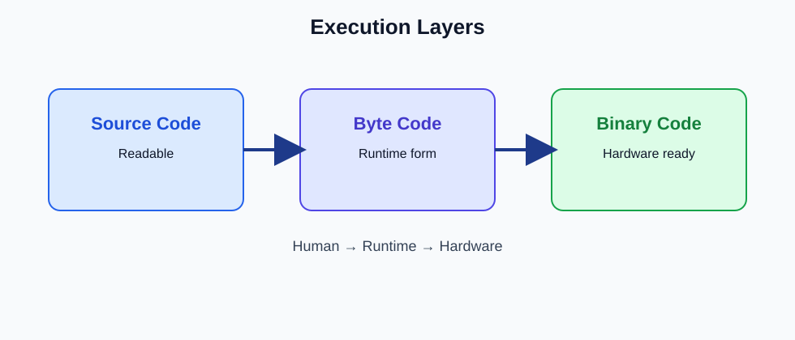

# Code Execution Formats

## TL;DR
- Source code is written by humans.
- Bytecode is the runtime’s intermediate form.
- Binary code is machine instructions executed by hardware.

## Pipeline Flow
`Source Code -> Bytecode -> Binary Code`

## Visual Layer Map

## Breakdown Table

| Metric / Layer | Source Code | Byte Code | Binary Code |
|---|---|---|---|
| Human Readability | High | Low | Very low |
| Target Evaluator | Developer | V8 runtime | CPU / OS |
| Code Construct Example | `await page.click("#submit")` | Runtime bytecode instructions | Native CPU instructions |
| Hardware Performance Impact | None directly | Medium | High |

## Automation Walkthrough
1. Source stage: the test writes `await page.click("#submit")`.
2. Bytecode stage: V8 turns that call into internal runtime instructions.
3. Binary stage: optimized machine code runs the click operation on the hardware.
