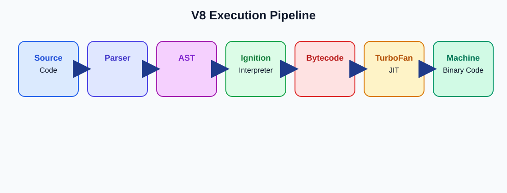

# V8 Engine Architecture and Usage

## Purpose
V8 is Google’s JavaScript engine that parses, executes, and optimizes JavaScript code. Node.js embeds V8, so Playwright test runners depend on it to execute automation scripts efficiently.

## How to Read the Diagram
The SVG diagram shows the V8 execution flow for JavaScript code used by Playwright:

`Source Code -> Parser -> AST -> Ignition Interpreter -> Bytecode -> TurboFan Compiler -> Machine/Binary Code`

- `Source Code`: The test script written by the engineer.
- `Parser`: Reads the code and checks syntax.
- `AST`: A structured tree form of the code used for analysis.
- `Ignition Interpreter`: Starts execution quickly and produces bytecode.
- `Bytecode`: A runtime intermediate form.
- `TurboFan Compiler`: Optimizes hot code paths using JIT compilation.
- `Machine/Binary Code`: Final native instructions executed by the CPU.

## Automation QA Engineer Perspective
- Parser and AST help catch invalid syntax early, before the Playwright test starts running.
- Ignition is important for fast startup and quick test execution.
- TurboFan improves repeated automation tasks such as clicks, waits, and locator resolution.
- Optimization is triggered when a function is used many times and becomes a hot path.
- Deoptimization happens when assumptions fail, such as changing data types or runtime behavior.
- For Playwright, this means stable repeated actions can get faster, while dynamic page behavior may trigger fallback paths.

## Pipeline Diagram
```text
Source Code -> Parser -> AST -> Ignition Interpreter -> Bytecode -> TurboFan Compiler -> Machine/Binary Code
```

## Visual Flow


## Execution Breakdown
- Parsing: Converts source code into an AST and checks syntax.
- Ignition Interpreter: Generates bytecode and begins execution.
- TurboFan JIT Compiler: Optimizes hot code paths into machine code.
- Optimization happens when code runs repeatedly enough to be a hot path.
- Deoptimization happens when assumptions fail, such as type changes.
