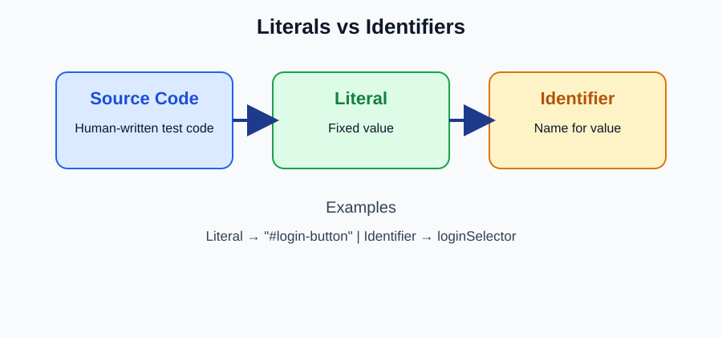

# Literals and Identifiers

## Literal
A literal is a fixed value written directly in source code.

## Identifier
An identifier is the name used to label a variable, function, class, object, or property.

```js
const loginSelector = "#login-button"; // identifier: selector variable name
const timeoutMs = 5000; // identifier: timeout configuration name
const buttonText = "Login"; // literal: fixed string value
```

## Visual Map


## Types for Test Engineers
- String literal: selector values and assertion text.
- Numeric literal: timeout values and retry counts.
- Boolean literal: feature flags and conditions.
- Object literal: dynamic test payloads.
- Array literal: parameterized test case inputs.
- Identifier: page object names, locator handles, test data aliases, and timeout configs.
