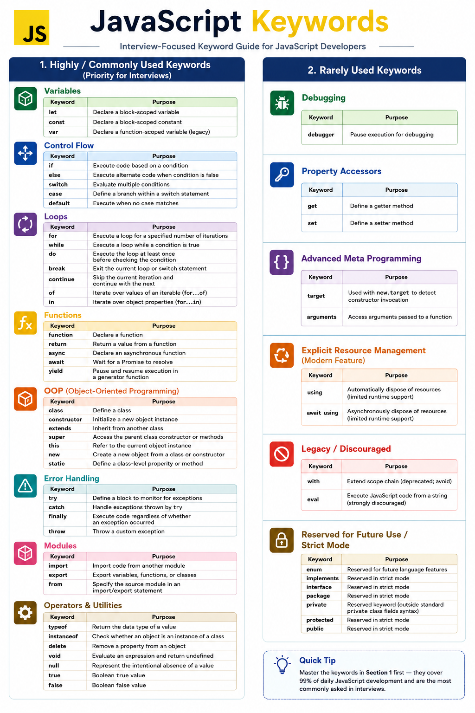

# JavaScript Keywords

> **Interview Focus:** Learn the keywords in the order shown below. These are the keywords most frequently used in modern JavaScript, TypeScript, React, Node.js, Playwright, and technical interviews.

---

# 1. Highly / Commonly Used Keywords

## Variables

| Keyword | Purpose |
|----------|---------|
| `let` | Declare a block-scoped variable. |
| `const` | Declare a block-scoped constant. |
| `var` | Declare a function-scoped variable (legacy). |

---

## Control Flow

| Keyword | Purpose |
|----------|---------|
| `if` | Execute code based on a condition. |
| `else` | Execute alternate code when the condition is false. |
| `switch` | Evaluate multiple conditions. |
| `case` | Define a branch within a `switch` statement. |
| `default` | Execute when no `case` matches. |

---

## Loops

| Keyword | Purpose |
|----------|---------|
| `for` | Execute a loop for a specified number of iterations. |
| `while` | Execute a loop while a condition is true. |
| `do` | Execute the loop once before checking the condition (`do...while`). |
| `break` | Exit the current loop or `switch` statement. |
| `continue` | Skip the current iteration and continue with the next. |
| `of` | Iterate over values of an iterable (`for...of`). |
| `in` | Iterate over object properties (`for...in`). |

---

## Functions

| Keyword | Purpose |
|----------|---------|
| `function` | Declare a function. |
| `return` | Return a value from a function. |
| `async` | Declare an asynchronous function. |
| `await` | Wait for a Promise to resolve. |
| `yield` | Pause and resume execution inside a generator function. |

---

## Object-Oriented Programming (OOP)

| Keyword | Purpose |
|----------|---------|
| `class` | Define a class. |
| `constructor` | Initialize a new object instance. |
| `extends` | Inherit from another class. |
| `super` | Access the parent class constructor or methods. |
| `this` | Refer to the current object instance. |
| `new` | Create a new object from a class or constructor. |
| `static` | Define a class-level property or method. |

---

## Error Handling

| Keyword | Purpose |
|----------|---------|
| `try` | Define a block to monitor for exceptions. |
| `catch` | Handle exceptions thrown by `try`. |
| `finally` | Execute code regardless of whether an exception occurred. |
| `throw` | Throw a custom exception. |

---

## Modules

| Keyword | Purpose |
|----------|---------|
| `import` | Import code from another module. |
| `export` | Export variables, functions, or classes. |
| `from` | Specify the source module in an `import` or `export` statement. |

---

## Operators & Utilities

| Keyword | Purpose |
|----------|---------|
| `typeof` | Return the data type of a value. |
| `instanceof` | Check whether an object is an instance of a class. |
| `delete` | Remove a property from an object. |
| `void` | Evaluate an expression and return `undefined`. |
| `null` | Represent the intentional absence of a value. |
| `true` | Boolean value representing **true**. |
| `false` | Boolean value representing **false**. |

---

# 2. Rarely Used Keywords

> These keywords are either used in advanced scenarios, are legacy features, or are reserved for future language enhancements.

---

## Debugging

| Keyword | Purpose |
|----------|---------|
| `debugger` | Pause program execution for debugging. |

---

## Property Accessors

| Keyword | Purpose |
|----------|---------|
| `get` | Define a getter method. |
| `set` | Define a setter method. |

---

## Advanced Meta Programming

| Keyword | Purpose |
|----------|---------|
| `target` | Used with `new.target` to detect constructor invocation. |
| `arguments` | Access the arguments passed to a function. |

---

## Explicit Resource Management *(New Feature)*

| Keyword | Purpose |
|----------|---------|
| `using` | Automatically dispose of resources (limited runtime support). |
| `await using` | Asynchronously dispose of resources (limited runtime support). |

---

## Legacy / Discouraged

| Keyword | Purpose |
|----------|---------|
| `with` | Extend the scope chain (**deprecated — avoid using**). |
| `eval` | Execute JavaScript code from a string (**strongly discouraged**). |

---

## Reserved for Future Use / Strict Mode

| Keyword | Purpose |
|----------|---------|
| `enum` | Reserved for future language features. |
| `implements` | Reserved in strict mode. |
| `interface` | Reserved in strict mode. |
| `package` | Reserved in strict mode. |
| `private` | Reserved keyword (outside standard private class field syntax). |
| `protected` | Reserved in strict mode. |
| `public` | Reserved in strict mode. |

---

# Interview Learning Priority

Master the keywords in the following order:

1. Variables
2. Control Flow
3. Loops
4. Functions
5. Object-Oriented Programming (OOP)
6. Error Handling
7. Modules
8. Operators & Utilities
9. Advanced & Rarely Used Keywords

