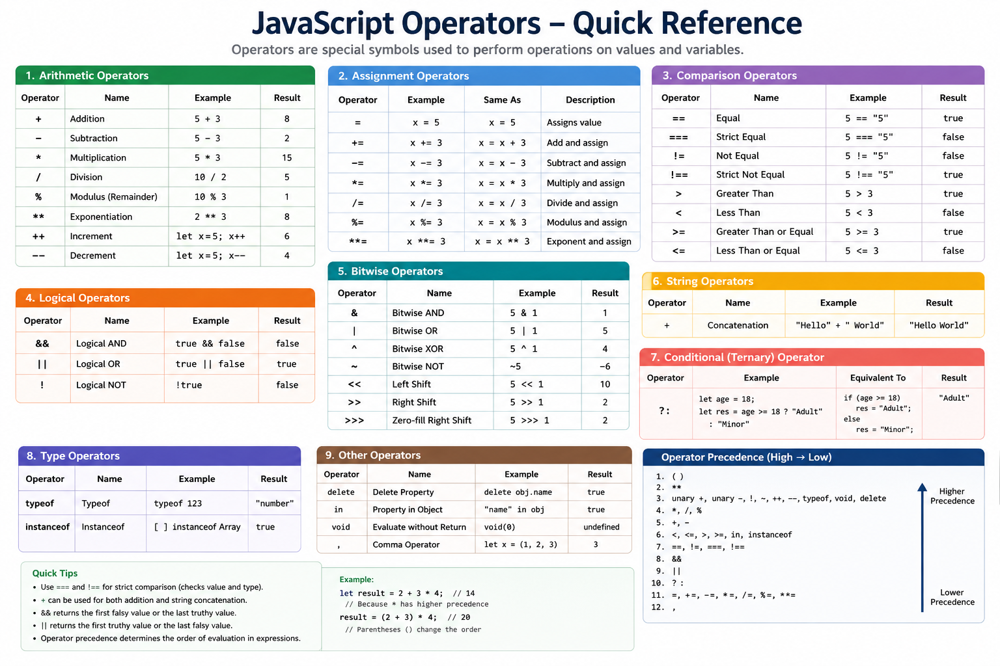

# JavaScript Operators

> **Definition:**  
> An **Operator** is a special symbol or keyword that performs an operation on one or more operands (values or variables) and returns a result.

**Example**

```javascript
let a = 10;
let b = 5;

console.log(a + b);   // 15
```

Here,

- `+` → Operator
- `a` and `b` → Operands
- `15` → Result

---

# Types of JavaScript Operators

| Type | Description | Example |
|------|-------------|---------|
| Arithmetic | Perform mathematical calculations | `+`, `-`, `*`, `/` |
| Assignment | Assign values to variables | `=`, `+=`, `-=`, `*=` |
| Comparison | Compare two values | `==`, `===`, `!=`, `>` |
| Logical | Combine multiple conditions | `&&`, `||`, `!` |
| Bitwise | Perform binary operations | `&`, `|`, `^` |
| String | Concatenate strings | `+`, `+=` |
| Conditional (Ternary) | Short form of `if...else` | `condition ? A : B` |
| Nullish Coalescing | Return default only for `null` or `undefined` | `??` |
| Optional Chaining | Safely access nested properties | `?.` |
| Type Operators | Check data type or object type | `typeof`, `instanceof` |
| Relational | Check property existence or iterate objects | `in` |
| Unary | Operate on a single operand | `++`, `--`, `delete`, `void` |
| Spread & Rest | Expand or collect values | `...` |

---

# 1. Arithmetic Operators

| Operator | Meaning | Example | Result |
|----------|---------|---------|--------|
| `+` | Addition | `10 + 5` | `15` |
| `-` | Subtraction | `10 - 5` | `5` |
| `*` | Multiplication | `10 * 5` | `50` |
| `/` | Division | `10 / 5` | `2` |
| `%` | Modulus (Remainder) | `10 % 3` | `1` |
| `**` | Exponent | `2 ** 3` | `8` |
| `++` | Increment | `x++` | Increase by 1 |
| `--` | Decrement | `x--` | Decrease by 1 |

### Example

```javascript
let a = 10;

console.log(a++); // 10
console.log(a);   // 11

console.log(++a); // 12
```

### Interview Question

**Difference between `a++` and `++a`?**

| `a++` | `++a` |
|--------|--------|
| Post Increment | Pre Increment |
| Return value first | Increment first |
| Then increase value | Then return value |

---

# 2. Assignment Operators

| Operator | Example | Equivalent |
|----------|---------|------------|
| `=` | `a = 5` | Assign value |
| `+=` | `a += 5` | `a = a + 5` |
| `-=` | `a -= 5` | `a = a - 5` |
| `*=` | `a *= 5` | `a = a * 5` |
| `/=` | `a /= 5` | `a = a / 5` |
| `%=` | `a %= 5` | `a = a % 5` |
| `**=` | `a **= 2` | `a = a ** 2` |

---

# 3. Comparison Operators

These operators always return **true** or **false**.

| Operator | Meaning | Example |
|----------|---------|---------|
| `==` | Equal (Loose Comparison) | `5 == "5"` → `true` |
| `===` | Strict Equal | `5 === "5"` → `false` |
| `!=` | Loose Not Equal | `5 != "5"` → `false` |
| `!==` | Strict Not Equal | `5 !== "5"` → `true` |
| `>` | Greater Than | `10 > 5` |
| `<` | Less Than | `5 < 10` |
| `>=` | Greater Than or Equal | `5 >= 5` |
| `<=` | Less Than or Equal | `5 <= 5` |

---

## ⭐ Interview Favourite

### `==` vs `===`

| `==` | `===` |
|------|--------|
| Loose Equality | Strict Equality |
| Converts data types | No type conversion |
| Can produce unexpected results | Recommended |
| Avoid in production code | Preferred in interviews |

```javascript
5 == "5"      // true

5 === "5"     // false
```

**Always prefer `===` and `!==`.**

---

# 4. Logical Operators

| Operator | Meaning | Example |
|----------|---------|---------|
| `&&` | AND | `age > 18 && citizen` |
| `||` | OR | `isAdmin || isManager` |
| `!` | NOT | `!loggedIn` |

### Example

```javascript
true && false     // false

true || false     // true

!true             // false
```

---

# 5. String Operators

| Operator | Meaning | Example |
|----------|---------|---------|
| `+` | Concatenate strings | `"Hello " + "World"` |
| `+=` | Append string | `name += " Kumar"` |

---

# 6. Conditional (Ternary) Operator

Syntax

```javascript
condition ? value1 : value2
```

Example

```javascript
let age = 20;

let result = age >= 18 ? "Adult" : "Minor";
```

Equivalent

```javascript
if(age >= 18){
   result = "Adult";
}else{
   result = "Minor";
}
```

---

# 7. Nullish Coalescing Operator (`??`)

Returns the right-side value **only when the left-side value is `null` or `undefined`**.

```javascript
let name = null;

console.log(name ?? "Guest");

// Guest
```

---

## ⭐ Interview Favourite

### Difference between `||` and `??`

| `||` | `??` |
|------|-------|
| Checks any falsy value | Checks only `null` or `undefined` |
| Replaces `0`, `false`, `""` | Keeps valid falsy values |

```javascript
0 || 10

// 10

0 ?? 10

// 0
```

---

# 8. Optional Chaining (`?.`)

Safely access nested properties without throwing an error.

```javascript
let user = {};

console.log(user.address?.city);

// undefined
```

Without Optional Chaining

```javascript
user.address.city

// Error
```

---

# 9. Type Operators

| Operator | Purpose | Example |
|----------|---------|---------|
| `typeof` | Return data type | `typeof 10` |
| `instanceof` | Check object type | `obj instanceof Array` |

Example

```javascript
typeof "Hello"

// string

typeof 10

// number

typeof true

// boolean
```

---

# 10. Relational Operator

## `in`

Checks whether a property exists in an object.

```javascript
const user = {
    name: "John"
};

console.log("name" in user);

// true
```

---

# 11. Unary Operators

| Operator | Purpose |
|----------|---------|
| `delete` | Remove object property |
| `void` | Return `undefined` |
| `++` | Increment |
| `--` | Decrement |
| `typeof` | Return data type |

Example

```javascript
delete user.name;
```

---

# 12. Spread & Rest Operator (`...`)

## Spread

Copies or expands values.

```javascript
const nums = [1,2,3];

const copy = [...nums];
```

---

## Rest

Collects multiple values.

```javascript
function sum(...numbers){

}
```

---

# Operator Precedence (Interview)

Higher precedence operators execute first.

```javascript
2 + 3 * 4

// 14
```

Equivalent

```javascript
2 + (3 * 4)
```

---

# Frequently Asked Interview Questions

| Question | Expected Answer |
|-----------|-----------------|
| Difference between `==` and `===`? | `===` checks both value and data type; `==` performs type coercion. |
| Difference between `||` and `??`? | `||` replaces all falsy values, while `??` replaces only `null` or `undefined`. |
| Difference between `a++` and `++a`? | `a++` returns the value first, then increments. `++a` increments first, then returns the updated value. |
| What does `typeof null` return? | `"object"` (a long-standing JavaScript quirk). |
| What does `typeof NaN` return? | `"number"`. |
| Difference between Spread (`...`) and Rest (`...`)? | Spread expands elements; Rest collects elements. |
| What is Optional Chaining (`?.`)? | Safely accesses nested properties without throwing an error. |
| What is Nullish Coalescing (`??`)? | Provides a default value only when the left operand is `null` or `undefined`. |
| Why should `===` be preferred over `==`? | It avoids implicit type coercion, making comparisons predictable and less error-prone. |

---

# Automation QE / Playwright Interview Focus ⭐⭐⭐⭐⭐

These operators are asked most frequently in Automation Testing interviews.

| Priority | Operator | Why Important |
|----------|----------|---------------|
| ⭐⭐⭐⭐⭐ | `===` | Assertions (`expect()`) and reliable comparisons. |
| ⭐⭐⭐⭐⭐ | `&&`, `||`, `!` | Locator conditions, validations, and branching logic. |
| ⭐⭐⭐⭐⭐ | `?.` | Prevent runtime errors when reading API or JSON responses. |
| ⭐⭐⭐⭐⭐ | `??` | Assign safe default values for missing API fields. |
| ⭐⭐⭐⭐☆ | `typeof` | Validate response data types. |
| ⭐⭐⭐⭐☆ | `instanceof` | Check object types and custom class instances. |
| ⭐⭐⭐⭐☆ | `...` (Spread/Rest) | Clone objects, merge test data, and pass variable arguments. |
| ⭐⭐⭐⭐☆ | `delete` | Modify mock objects or API payloads during tests. |
| ⭐⭐⭐☆☆ | `in` | Verify object properties exist in API responses. |
| ⭐⭐⭐☆☆ | Ternary (`?:`) | Write concise conditional logic in test scripts. |

---

# Quick Revision Sheet

| Category | Operators |
|-----------|-----------|
| Arithmetic | `+` `-` `*` `/` `%` `**` `++` `--` |
| Assignment | `=` `+=` `-=` `*=` `/=` `%=` `**=` |
| Comparison | `==` `===` `!=` `!==` `>` `<` `>=` `<=` |
| Logical | `&&` `||` `!` |
| String | `+` `+=` |
| Conditional | `?:` |
| Nullish | `??` |
| Optional Chaining | `?.` |
| Type | `typeof` `instanceof` |
| Relational | `in` |
| Unary | `delete` `void` `++` `--` |
| Modern JavaScript | `...` (Spread & Rest) |

> **Interview Tip:** For JavaScript Automation (Playwright/Cypress/WebdriverIO), the operators you'll use most often are **`===`**, **`&&`**, **`||`**, **`!`**, **`?.`**, **`??`**, **`typeof`**, **`instanceof`**, **`...`**, and the **Ternary (`?:`)** operator.