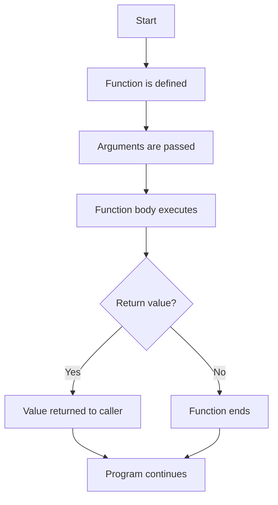

# 16. Functions in JavaScript

Based on the examples in [chapter_10_Functions](../chapter_10_Functions).

---

## 1) What is a Function?

A function is a reusable block of code that performs a specific task.
It helps us avoid writing the same logic again and again.

```js
function greet() {
  console.log("Hello, learner!");
}

greet(); // call the function
```

### Why functions are important
- Reusability
- Better organization
- Easier debugging
- Cleaner code

---

## 2) Function Syntax

```js
function functionName(parameters) {
  // code to execute
  return result;
}
```

### Example
```js
function add(a, b) {
  return a + b;
}

console.log(add(3, 5)); // 8
```

### Important points
- `functionName` is the name of the function.
- `parameters` are placeholders inside the function.
- `arguments` are actual values passed when the function is called.

---

## 3) Parameters and Arguments

```js
function greet(name) { // name is a parameter
  return `Hello, ${name}`;
}

console.log(greet("Amit")); // Amit is an argument
```

### Simple explanation
- Parameter = variable declared in the function definition.
- Argument = value passed while calling the function.

---

## 4) Return Statement

The `return` statement sends a value back to the caller.

```js
function square(num) {
  return num * num;
}

let result = square(4);
console.log(result); // 16
```

### Difference between `return` and `console.log()`
- `return` gives a value back.
- `console.log()` only prints output in the console.

```js
function test() {
  return 10;
}

console.log(test()); // 10
```

---

## 5) Function Declaration

A function declaration is created using the `function` keyword.

```js
function showMessage() {
  console.log("This is a function declaration.");
}

showMessage();
```

### Key point
Function declarations are hoisted, which means they can be called before they are defined.

```js
showGreeting();

function showGreeting() {
  console.log("Hello from hoisting!");
}
```

---

## 6) Function Expression

A function expression assigns a function to a variable.

```js
const greetUser = function(name) {
  return `Hello, ${name}`;
};

console.log(greetUser("John"));
```

### Important note
Function expressions are not hoisted like declarations.

```js
// const greetUser = function() { ... };
// This must be declared before use.
```

---

## 7) Anonymous Function

An anonymous function has no name.
It is usually used in expressions.

```js
const addNumbers = function(a, b) {
  return a + b;
};

console.log(addNumbers(2, 3));
```

### Use case
Anonymous functions are common in callbacks and event handling.

---

## 8) Arrow Function

Arrow functions provide shorter syntax.

```js
const multiply = (a, b) => a * b;
console.log(multiply(4, 5)); // 20
```

### Another example
```js
const greet = name => `Hello, ${name}`;
console.log(greet("Sara"));
```

### Benefits of arrow functions
- Shorter syntax
- Cleaner code
- Often used with arrays and callbacks

---

## 9) Default Parameters

Default parameters allow a function to use a fallback value if no argument is passed.

```js
function welcome(name = "Guest") {
  return `Welcome, ${name}`;
}

console.log(welcome());        // Welcome, Guest
console.log(welcome("Ravi")); // Welcome, Ravi
```

---

## 10) Rest Parameters

A rest parameter collects multiple values into an array.

```js
function sum(...numbers) {
  let total = 0;
  for (let num of numbers) {
    total += num;
  }
  return total;
}

console.log(sum(1, 2, 3, 4)); // 10
```

### Why it is useful
It helps when the number of arguments is unknown.

---

## 11) Spread Operator in Functions

The spread operator expands array values into separate arguments.

```js
function addThree(a, b, c) {
  return a + b + c;
}

const values = [10, 20, 30];
console.log(addThree(...values)); // 60
```

### Difference between spread and rest
- `...args` in a function definition = rest parameter
- `...values` while calling a function = spread operator

---

## 12) Callback Functions

A callback function is passed as an argument to another function.

```js
function applyOperation(a, b, callback) {
  return callback(a, b);
}

const result = applyOperation(5, 3, (x, y) => x + y);
console.log(result); // 8
```

### Simple explanation
The function `applyOperation` uses another function to do the real work.

---

## 13) IIFE (Immediately Invoked Function Expression)

An IIFE runs immediately after it is defined.

```js
(function () {
  console.log("This runs immediately!");
})();
```

### Use cases
- Avoid polluting global scope
- Run setup code instantly

---

## 14) Hoisting in Functions

Hoisting means the JavaScript engine can access some declarations before they are written.

```js
sayHello();

function sayHello() {
  console.log("Hello from hoisting");
}
```

### Important note
Function expressions and arrow functions do not behave the same way.

```js
const sayHi = () => console.log("Hi");
sayHi();
```

---

## 15) Real-World Example

```js
function isEligible(age) {
  return age >= 18 ? "Eligible" : "Not Eligible";
}

console.log(isEligible(22)); // Eligible
console.log(isEligible(15)); // Not Eligible
```

### Explanation
This function checks whether a user is eligible based on age.

---

## 16) Function Flow Diagram



---

## 17) Quick Interview Notes

- A function is a reusable block of code.
- Parameters are placeholders, arguments are actual values.
- `return` sends data back to the caller.
- Function declarations are hoisted.
- Function expressions and arrow functions are assigned to variables.
- Arrow functions are shorter and commonly used in modern JavaScript.
- IIFE runs immediately.
- Callback functions are passed into other functions.

---

## 18) Function Scope

Functions have their own scope. Variables declared inside are local; outside is global.

```js
let env = "Staging";  // Global scope

function setupConfig() {
  let timeout = 3000; // Local scope
  console.log(env);   // Can access global
  console.log(timeout); // Can access local
}

setupConfig();
console.log(env);    // Can access - it's global
console.log(timeout); // ReferenceError - can't access local
```

### Key Point
- Global variables can be accessed inside functions.
- Local variables cannot be accessed outside the function.
- This prevents unintended variable overwriting.

---

## 19) var vs let vs const in Functions

### Important difference in function context:

**var** - Function scoped (old, avoid it)
```js
function demo() {
  var a = 10;
  if (true) {
    var a = 20; // Overwrites outer var
    console.log(a); // 20
  }
  console.log(a); // 20 (modified)
}
```

**let** - Block scoped (modern, reassignable)
```js
function demo() {
  let a = 10;
  if (true) {
    let a = 20; // Different variable, block scope
    console.log(a); // 20
  }
  console.log(a); // 10 (unchanged)
}
```

**const** - Block scoped (modern, immutable)
```js
function demo() {
  const a = 10;
  if (true) {
    const a = 20; // Different variable
    console.log(a); // 20
  }
  console.log(a); // 10
}
```

### Interview Tip
- `var` in functions leaks out of block scopes (dangerous).
- `let` and `const` respect block boundaries (safer).
- Use `const` by default, `let` when reassignment is needed, never use `var`.

---

## 20) Hoisting in Functions - Deep Dive

### What is Hoisting?

Hoisting means JavaScript moves **declarations** (not initializations) to the top of their scope during compilation phase.

**var hoisting:**
```js
console.log(x); // undefined (declaration is hoisted)
var x = 5;
console.log(x); // 5
```

### Function Declaration Hoisting

Function declarations are FULLY hoisted (declaration + body).

```js
sayHello();

function sayHello() {
  console.log("Hello!"); // Works - function is fully hoisted
}
```

### Function Expression NOT Hoisted

Function expressions are NOT hoisted like declarations.

```js
sayHi(); // TypeError: sayHi is not a function

const sayHi = function() {
  console.log("Hi");
};
```

### Arrow Function NOT Hoisted

Arrow functions have same behavior as function expressions.

```js
greet(); // ReferenceError

const greet = () => console.log("Hi");
```

### ⚠️ Tricky Question for Experienced QE

```js
console.log(typeof myFunc); // "function" (declaration wins)

var myFunc = "I am a String";

function myFunc() {
  return "I am a Function";
}

console.log(typeof myFunc); // "string" (var assignment overwrites)
```

**Explanation:** During hoisting, the function declaration gets priority. But during execution, `var myFunc = "..."` overwrites it.

---

## 21) Temporal Dead Zone (TDZ)

### What is TDZ?

TDZ is the time between entering a scope and reaching the declaration of a `let` or `const` variable.
During this period, the variable exists but cannot be accessed.

```js
console.log(name); // ReferenceError: Cannot access 'name' before initialization

let name = "John";
console.log(name); // "John"
```

### TDZ with Block Scope

```js
let name = "Outer";

if (true) {
  console.log(name); // ReferenceError - TDZ for inner 'name'
  let name = "Inner"; // TDZ ends here
}
```

### var does NOT have TDZ

```js
console.log(age); // undefined (not an error)
var age = 25;
```

### Interview Tip
- `var` = No TDZ (hoisted as undefined)
- `let` and `const` = TDZ exists (ReferenceError if accessed before declaration)

---

## 22) Closure Functions

### What is a Closure?

A closure is when a function "remembers" variables from its parent scope even after the parent function has finished executing.

```js
function startBrowser() {
  let browserName = "Chrome"; // Parent scope variable

  function openBrowser() {
    console.log(browserName); // Child remembers parent's variable
  }

  return openBrowser; // Return the function
}

const myBrowser = startBrowser();
myBrowser(); // Output: "Chrome"
```

### How Closure Works

1. Inner function is created inside outer function.
2. Inner function uses variables from outer function.
3. Outer function returns the inner function.
4. Even after outer function ends, inner function still has access to outer variables.

### Real-World Closure Example - Counter

```js
function createCounter() {
  let count = 0; // This variable is "captured" by the closure

  return {
    increment() { count++; },
    decrement() { count--; },
    getCount() { return count; }
  };
}

const counter = createCounter();
counter.increment();
console.log(counter.getCount()); // 1
counter.increment();
console.log(counter.getCount()); // 2
```

### Real-World Closure for Testing - Login Retry Tracker

```js
function maxRetryTracker(maxAttempts) {
  let attempts = 0;

  function tryLogin(testName) {
    attempts++;

    if (attempts > maxAttempts) {
      return `${testName} exceeded max retries (${maxAttempts})`;
    }
    return `Attempt ${attempts}/${maxAttempts} for ${testName}`;
  }

  return tryLogin;
}

let loginTracker = maxRetryTracker(3);
console.log(loginTracker("Login")); // Attempt 1/3 for Login
console.log(loginTracker("Login")); // Attempt 2/3 for Login
console.log(loginTracker("Login")); // Attempt 3/3 for Login
console.log(loginTracker("Login")); // Login exceeded max retries (3)
```

### Why Closure is Important for Automation QE

Closures are perfect for:
- **Creating data factories** - Generate test data with state.
- **Retry mechanisms** - Track retry counts for flaky tests.
- **Test fixtures** - Set up and tear down test environments.
- **Private variables** - Encapsulate data that shouldn't be exposed.

---

## 23) Closure Memory Trap

Each closure instance has its own memory space:

```js
let tracker1 = maxRetryTracker(3);
let tracker2 = maxRetryTracker(3);

console.log(tracker1("Test")); // Attempt 1/3
console.log(tracker1("Test")); // Attempt 2/3
console.log(tracker2("Test")); // Attempt 1/3 (separate counter!)
```

### Interview Tip
- Each call to `maxRetryTracker()` creates a NEW closure with its own `attempts` variable.
- They don't share the same `attempts` - they're independent.

---

## 24) Function Declarations Inside Blocks - NOT Recommended

### Problem

```js
if (true) {
  function test() {
    return "inside if";
  }
}

// Inconsistent behavior across browsers
```

### Solution - Use Function Expression

```js
let test;

if (true) {
  test = function() {
    return "inside if";
  };
}

console.log(test()); // "inside if"
```

### Interview Tip
- Define functions at appropriate scope levels, not inside conditional blocks.
- Use function expressions if you must assign conditionally.

---

## 25) Tricky Interview Questions for Experienced QE

### Question 1: Hoisting with Function Declaration and var Variable

```js
console.log(typeof myFunc); // What will this print?

var myFunc = "I am a String";

function myFunc() {
  return "I am a Function";
}

console.log(typeof myFunc);
```

**Answer:** First is "function", second is "string". Function declaration wins during hoisting, but var assignment overwrites it.

### Question 2: Closure with Loop

```js
function createFunctions() {
  const funcs = [];
  
  for (var i = 0; i < 3; i++) {
    funcs.push(function() {
      return i;
    });
  }
  
  return funcs;
}

const funcs = createFunctions();
console.log(funcs[0]()); // What will this print?
console.log(funcs[1]());
console.log(funcs[2]());
```

**Answer:** All print 3. Because `var i` is function-scoped, all closures share the same `i`, which becomes 3 after the loop. **Fix:** Use `let` instead of `var`.

### Question 3: TDZ in Different Scenarios

```js
function test() {
  console.log(typeof x); // undefined (var has no TDZ)
  var x = 5;
}

function test2() {
  console.log(typeof y); // ReferenceError (let has TDZ)
  let y = 5;
}
```

**Key:** `typeof` doesn't prevent ReferenceError when a variable is in TDZ.

### Question 4: Closure Data Privacy

```js
function createUser(initialBalance) {
  let balance = initialBalance;

  return {
    deposit(amount) { balance += amount; },
    withdraw(amount) { balance -= amount; },
    getBalance() { return balance; }
  };
}

const user = createUser(1000);
user.balance = 999999; // Can you change it this way?
console.log(user.getBalance());
```

**Answer:** Prints 1000. The `balance` variable is private to the closure; directly assigning `user.balance` creates a new property but doesn't affect the closure's variable. **This is why closures are great for data privacy.**

---

## Summary

Functions are fundamental to JavaScript and essential for Playwright automation:

- **Function Scope**: Global vs Local access
- **var vs let vs const**: Scope and hoisting differences
- **Hoisting**: Declarations move up, initializations don't
- **TDZ**: Safe guard preventing pre-initialization access
- **Closures**: Functions remembering parent scope - useful for state, counters, and data privacy
- **Best Practices**: Use const/let, avoid var, define functions at proper scopes

Master these concepts to write robust, maintainable test automation code!
