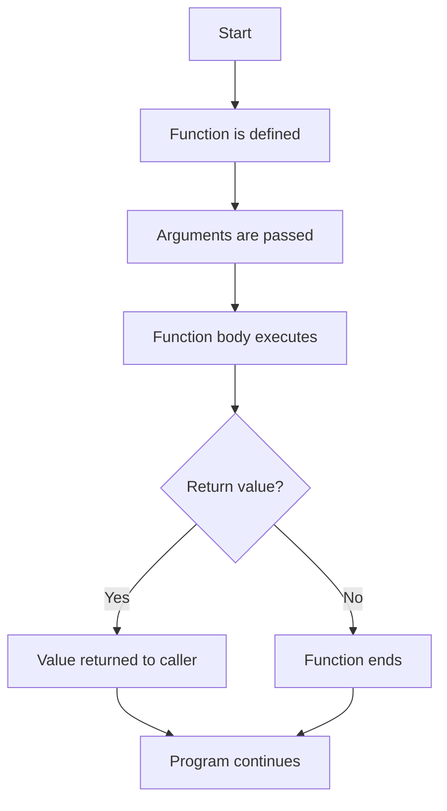

# 16. Functions in JavaScript

Based on the examples in [chapter_10_Functions](../chapter_10_Functions).

---

## 1) What is a Function?

A function is a reusable block of code that performs a specific task.
It helps us avoid writing the same logic again and again.

```js
function greet() {
  console.log("Hello, learner!");
}

greet(); // call the function
```

### Why functions are important
- Reusability
- Better organization
- Easier debugging
- Cleaner code

---

## 2) Function Syntax

```js
function functionName(parameters) {
  // code to execute
  return result;
}
```

### Example
```js
function add(a, b) {
  return a + b;
}

console.log(add(3, 5)); // 8
```

### Important points
- `functionName` is the name of the function.
- `parameters` are placeholders inside the function.
- `arguments` are actual values passed when the function is called.

---

## 3) Parameters and Arguments

```js
function greet(name) { // name is a parameter
  return `Hello, ${name}`;
}

console.log(greet("Amit")); // Amit is an argument
```

### Simple explanation
- Parameter = variable declared in the function definition.
- Argument = value passed while calling the function.

---

## 4) Return Statement

The `return` statement sends a value back to the caller.

```js
function square(num) {
  return num * num;
}

let result = square(4);
console.log(result); // 16
```

### Difference between `return` and `console.log()`
- `return` gives a value back.
- `console.log()` only prints output in the console.

```js
function test() {
  return 10;
}

console.log(test()); // 10
```

---

## 5) Function Declaration

A function declaration is created using the `function` keyword.

```js
function showMessage() {
  console.log("This is a function declaration.");
}

showMessage();
```

### Key point
Function declarations are hoisted, which means they can be called before they are defined.

```js
showGreeting();

function showGreeting() {
  console.log("Hello from hoisting!");
}
```

---

## 6) Function Expression

A function expression assigns a function to a variable.

```js
const greetUser = function(name) {
  return `Hello, ${name}`;
};

console.log(greetUser("John"));
```

### Important note
Function expressions are not hoisted like declarations.

```js
// const greetUser = function() { ... };
// This must be declared before use.
```

---

## 7) Anonymous Function

An anonymous function has no name.
It is usually used in expressions.

```js
const addNumbers = function(a, b) {
  return a + b;
};

console.log(addNumbers(2, 3));
```

### Use case
Anonymous functions are common in callbacks and event handling.

---

## 8) Arrow Function

Arrow functions provide shorter syntax.

```js
const multiply = (a, b) => a * b;
console.log(multiply(4, 5)); // 20
```

### Another example
```js
const greet = name => `Hello, ${name}`;
console.log(greet("Sara"));
```

### Benefits of arrow functions
- Shorter syntax
- Cleaner code
- Often used with arrays and callbacks

---

## 9) Default Parameters

Default parameters allow a function to use a fallback value if no argument is passed.

```js
function welcome(name = "Guest") {
  return `Welcome, ${name}`;
}

console.log(welcome());        // Welcome, Guest
console.log(welcome("Ravi")); // Welcome, Ravi
```

---

## 10) Rest Parameters

A rest parameter collects multiple values into an array.

```js
function sum(...numbers) {
  let total = 0;
  for (let num of numbers) {
    total += num;
  }
  return total;
}

console.log(sum(1, 2, 3, 4)); // 10
```

### Why it is useful
It helps when the number of arguments is unknown.

---

## 11) Spread Operator in Functions

The spread operator expands array values into separate arguments.

```js
function addThree(a, b, c) {
  return a + b + c;
}

const values = [10, 20, 30];
console.log(addThree(...values)); // 60
```

### Difference between spread and rest
- `...args` in a function definition = rest parameter
- `...values` while calling a function = spread operator

---

## 12) Callback Functions

A callback function is passed as an argument to another function.

```js
function applyOperation(a, b, callback) {
  return callback(a, b);
}

const result = applyOperation(5, 3, (x, y) => x + y);
console.log(result); // 8
```

### Simple explanation
The function `applyOperation` uses another function to do the real work.

---

## 13) IIFE (Immediately Invoked Function Expression)

An IIFE runs immediately after it is defined.

```js
(function () {
  console.log("This runs immediately!");
})();
```

### Use cases
- Avoid polluting global scope
- Run setup code instantly

---

## 14) Hoisting in Functions

Hoisting means the JavaScript engine can access some declarations before they are written.

```js
sayHello();

function sayHello() {
  console.log("Hello from hoisting");
}
```

### Important note
Function expressions and arrow functions do not behave the same way.

```js
const sayHi = () => console.log("Hi");
sayHi();
```

---

## 15) Real-World Example

```js
function isEligible(age) {
  return age >= 18 ? "Eligible" : "Not Eligible";
}

console.log(isEligible(22)); // Eligible
console.log(isEligible(15)); // Not Eligible
```

### Explanation
This function checks whether a user is eligible based on age.

---

## 16) Function Flow Diagram



---

## 17) Quick Interview Notes

- A function is a reusable block of code.
- Parameters are placeholders, arguments are actual values.
- `return` sends data back to the caller.
- Function declarations are hoisted.
- Function expressions and arrow functions are assigned to variables.
- Arrow functions are shorter and commonly used in modern JavaScript.
- IIFE runs immediately.
- Callback functions are passed into other functions.

---

## 18) Summary

Functions are one of the most important concepts in JavaScript.
They help make code modular, reusable, and easy to maintain.
In automation and Playwright, functions are very useful for writing cleaner test scripts and reusing common logic such as login, navigation, and assertions.
