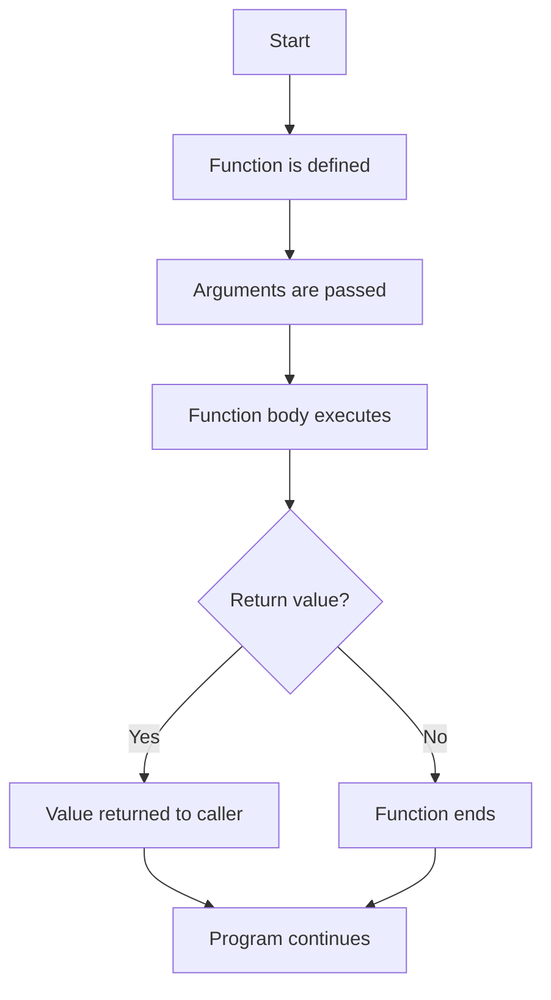

# Interview Q&A for JavaScript + Playwright Learning Notes

This file is based on the examples available in the project folders such as [chapter_02_Java_Concepts](../chapter_02_Java_Concepts), [chapter_03_Identifiers](../chapter_03_Identifiers), [chapter_04_Literals](../chapter_04_Literals), [chapter_05_Operators](../chapter_05_Operators), [chapter_06_Switch_Statement](../chapter_06_Switch_Statement), [chapter_07_If_Else_Statements](../chapter_07_If_Else_Statements), [chapter_08_Loops](../chapter_08_Loops), [chapter_09_Arrays](../chapter_09_Arrays), and [chapter_10_Functions](../chapter_10_Functions).

## 1. JavaScript Basics

### Q1. What is JavaScript?
**Answer:** JavaScript is a programming language used to make webpages interactive and to automate browser actions in tools like Playwright.

### Q2. What is the difference between `let`, `const`, and `var`?
**Answer:**
- `var` is old and has function scope.
- `let` can be reassigned but not redeclared in the same scope.
- `const` cannot be reassigned.

```js
let age = 20;
const name = "John";
```

### Q3. What is a variable?
**Answer:** A variable is a container used to store data.

```js
let score = 100;
```

---

## 2. Identifiers and Comments

### Q4. What is an identifier?
**Answer:** An identifier is the name given to variables, functions, or objects.

```js
let studentName = "Amit";
```

### Q5. What are the rules for identifiers?
**Answer:**
- They should start with a letter, `_`, or `$`.
- They cannot start with a number.
- They should be meaningful and readable.

### Q6. What are comments in JavaScript?
**Answer:** Comments are used to explain code. They are ignored by the JavaScript engine.

```js
// Single-line comment
/* Multi-line comment */
```

---

## 3. Literals and Data Types

### Q7. What is a literal?
**Answer:** A literal is a fixed value written directly in code.

```js
let name = "Alice"; // string literal
let age = 25;       // number literal
let isActive = true; // boolean literal
```

### Q8. What is the difference between `null` and `undefined`?
**Answer:**
- `undefined` means a variable is declared but has no value yet.
- `null` means the value is intentionally empty.

```js
let a;
console.log(a); // undefined

let b = null;
console.log(b); // null
```

### Q9. What are the main JavaScript data types?
**Answer:** String, Number, Boolean, Null, Undefined, Object, Symbol, and BigInt.

### Q10. What does `typeof` do?
**Answer:** It tells the data type of a value.

```js
console.log(typeof "Hello"); // string
console.log(typeof 10);       // number
```

---

## 4. Operators

### Q11. What is the difference between `==` and `===`?
**Answer:**
- `==` compares only values.
- `===` compares both value and type.

```js
console.log(5 == "5");  // true
console.log(5 === "5"); // false
```

### Q12. What is the ternary operator?
**Answer:** It is a short form of `if-else`.

```js
let age = 18;
let result = age >= 18 ? "Adult" : "Minor";
```

### Q13. What is the nullish coalescing operator (`??`)?
**Answer:** It returns the right-side value when the left-side is `null` or `undefined`.

```js
let value = null ?? "Default";
console.log(value); // Default
```

### Q14. What is the difference between `++` and `--`?
**Answer:** They increase or decrease a number by 1.

```js
let x = 5;
x++;
console.log(x); // 6
```

---

## 5. Conditional Statements

### Q15. What is the difference between `if`, `else if`, and `else`?
**Answer:** They are used to run code based on conditions.

```js
let age = 18;
if (age >= 18) {
  console.log("Adult");
} else {
  console.log("Minor");
}
```

### Q16. What is a `switch` statement?
**Answer:** It is useful when you want to compare one value against many cases.

```js
let day = 2;
switch (day) {
  case 1: console.log("Monday"); break;
  case 2: console.log("Tuesday"); break;
  default: console.log("Other");
}
```

---

## 6. Loops

### Q17. What is the difference between `for`, `while`, and `do...while`?
**Answer:**
- `for` is used when the number of iterations is known.
- `while` checks the condition before running.
- `do...while` runs at least once before checking the condition.

### Q18. What is the use of `break` and `continue`?
**Answer:**
- `break` stops the loop completely.
- `continue` skips the current iteration.

```js
for (let i = 0; i < 5; i++) {
  if (i === 2) continue;
  console.log(i);
}
```

---

## 7. Arrays

### Q19. What is an array?
**Answer:** An array stores multiple values in one variable.

```js
const fruits = ["Apple", "Banana", "Mango"];
```

### Q20. What is the difference between `push()` and `pop()`?
**Answer:**
- `push()` adds an element to the end.
- `pop()` removes the last element.

### Q21. What is the difference between `unshift()` and `shift()`?
**Answer:**
- `unshift()` adds an element to the start.
- `shift()` removes the first element.

### Q22. What is `splice()` used for?
**Answer:** `splice()` is used to add, remove, or replace elements. It changes the original array.

```js
let arr = [1, 2, 3];
arr.splice(1, 1, 99);
console.log(arr); // [1, 99, 3]
```

### Q23. What is the difference between `splice()` and `slice()`?
**Answer:**
- `splice()` changes the original array.
- `slice()` creates a new array and leaves the original unchanged.

### Q24. What is `indexOf()` and `includes()` used for?
**Answer:** They are used to search for an element in an array.

```js
let result = ["Pass", "Fail", "Skip"];
console.log(result.indexOf("Skip")); // 2
console.log(result.includes("Pass")); // true
```

### Q25. What is the difference between `find()` and `filter()`?
**Answer:**
- `find()` returns the first matching value.
- `filter()` returns all matching values.

### Q26. What is `map()`, `filter()`, and `reduce()` used for?
**Answer:**
- `map()` transforms each item.
- `filter()` keeps selected items.
- `reduce()` combines values into one result.

```js
let nums = [1, 2, 3];
let doubled = nums.map(x => x * 2);
let even = nums.filter(x => x % 2 === 0);
let total = nums.reduce((sum, x) => sum + x, 0);
```

### Q27. How can you check if a value is an array?
**Answer:** Use `Array.isArray(value)`.

```js
let nums = [1, 2, 3];
console.log(Array.isArray(nums)); // true
```

### Q28. What is array destructuring?
**Answer:** It allows you to unpack values from an array into variables.

```js
let [first, second] = ["A", "B"];
console.log(first); // A
```

---

## 8. Functions in JavaScript

### Q29. What is a function in JavaScript?
**Answer:** A function is a reusable block of code that performs a specific task.

```js
function greet() {
  console.log("Hello");
}

greet();
```

### Q30. What is the difference between a parameter and an argument?
**Answer:**
- A parameter is a variable declared in the function definition.
- An argument is the actual value passed when the function is called.

```js
function add(a, b) { // a and b are parameters
  return a + b;
}

console.log(add(2, 3)); // 2 and 3 are arguments
```

### Q31. What is the use of `return` in a function?
**Answer:** `return` sends a value back to the caller.

```js
function square(num) {
  return num * num;
}

console.log(square(4)); // 16
```

### Q32. What is a function declaration?
**Answer:** A function declaration defines a function using the `function` keyword.

```js
function greetUser() {
  console.log("Welcome!");
}
```

### Q33. What is a function expression?
**Answer:** A function expression assigns a function to a variable.

```js
const greet = function(name) {
  return `Hello, ${name}`;
};
```

### Q34. What is an arrow function?
**Answer:** An arrow function is a shorter syntax for writing functions.

```js
const multiply = (a, b) => a * b;
console.log(multiply(2, 4)); // 8
```

### Q35. What are default parameters?
**Answer:** Default parameters provide fallback values if an argument is not provided.

```js
function welcome(name = "Guest") {
  return `Hello, ${name}`;
}

console.log(welcome()); // Hello, Guest
```

### Q36. What is a callback function?
**Answer:** A callback function is passed as an argument to another function and executed later.

```js
function greetLater(name, callback) {
  callback(name);
}

greetLater("Amit", function(n) {
  console.log(`Hello, ${n}`);
});
```

### Q37. What is an IIFE?
**Answer:** An IIFE is an Immediately Invoked Function Expression that runs as soon as it is defined.

```js
(function () {
  console.log("Runs immediately");
})();
```

### Q38. What is hoisting in functions?
**Answer:** Hoisting allows function declarations to be called before they are defined in code.

```js
showMessage();

function showMessage() {
  console.log("Hi");
}
```

### Q39. What is the difference between a normal function and an arrow function?
**Answer:**
- Normal functions have their own `this` behavior.
- Arrow functions inherit `this` from the surrounding scope.

```js
const obj = {
  value: 10,
  show: function() {
    console.log(this.value);
  },
  showArrow: () => {
    console.log(this.value);
  }
};
```

### Q40. Why are functions important in Playwright?
**Answer:** Functions help make test scripts reusable and cleaner. Common actions like login, navigation, and assertion logic can be placed inside functions.

```js
function login(username, password) {
  console.log(`Logging in as ${username}`);
  return true;
}

login("admin", "1234");
```

### Function Flow Diagram



### Quick Revision Tips
- Learn the syntax of function declaration, expression, and arrow function.
- Understand the difference between `parameter` and `argument`.
- Remember that `return` sends back a value.
- Practice callback functions and IIFE concepts.
- Know why functions are useful in automation and Playwright.

---

## 9. Advanced Function Concepts (For Experienced QE)

### Q41. Explain the deep difference between `var`, `let`, and `const` in the context of functions.

**Answer:** The key differences are in hoisting behavior and scope:

**var** - Function scoped (problematic)
```js
function demo() {
  var a = 10;
  if (true) {
    var a = 20;      // Same variable!
    console.log(a);  // 20
  }
  console.log(a);    // 20 (modified!)
}
```

**let** - Block scoped (safe)
```js
function demo() {
  let a = 10;
  if (true) {
    let a = 20;      // Different variable
    console.log(a);  // 20
  }
  console.log(a);    // 10 (unchanged)
}
```

**const** - Block scoped, immutable (preferred)
```js
function demo() {
  const a = 10;
  if (true) {
    const a = 20;    // Different variable
    console.log(a);  // 20
  }
  console.log(a);    // 10
}
```

**Rule for Automation QE:** Use `const` by default, `let` when reassignment needed, never use `var`.

---

### Q42. What is hoisting in functions? Why does it matter?

**Answer:** Hoisting is when JavaScript moves declarations to the top of their scope during the compilation phase.

**Function Declaration - FULLY hoisted:**
```js
sayHello();  // Works!

function sayHello() {
  console.log("Hello!");
}
```

**Function Expression - NOT hoisted:**
```js
sayHi();  // TypeError: sayHi is not a function

const sayHi = function() {
  console.log("Hi");
};
```

**var variable hoisting:**
```js
console.log(x);  // undefined (not an error!)
var x = 5;
console.log(x);  // 5
```

**Automation QE Tip:** Always declare functions before using them. Avoid relying on hoisting for readability.

---

### Q43. What is Temporal Dead Zone (TDZ)?

**Answer:** TDZ is the time between entering a scope and reaching the variable declaration. During TDZ, the variable exists but cannot be accessed.

```js
console.log(name);  // ReferenceError: Cannot access 'name' before initialization

let name = "John";
console.log(name);  // "John"
```

**Block scope example:**
```js
let name = "Outer";

if (true) {
  console.log(name);  // ReferenceError (TDZ for inner 'name')
  let name = "Inner";
}
```

**var does NOT have TDZ:**
```js
console.log(age);  // undefined (no error)
var age = 25;
```

**Automation QE Tip:** This is why using `let` and `const` is safer - TDZ catches bugs early.

---

### Q44. What is a Closure? Explain with a real automation example.

**Answer:** A closure is when a function "remembers" variables from its parent scope even after the parent function has returned.

**Simple Example:**
```js
function createBrowser() {
  let browserName = "Chrome";

  function launch() {
    console.log(`Launching ${browserName}`);
  }

  return launch;
}

const myBrowser = createBrowser();
myBrowser();  // Output: "Launching Chrome"
```

**Real Automation Example - Login Retry Tracker:**
```js
function createLoginTracker(maxAttempts) {
  let attempts = 0;

  function login(username) {
    attempts++;
    if (attempts > maxAttempts) {
      return `Failed: ${username} exceeded ${maxAttempts} retries`;
    }
    return `Attempt ${attempts}/${maxAttempts} - Trying to login as ${username}`;
  }

  return login;
}

const loginTest = createLoginTracker(3);
console.log(loginTest("admin"));  // Attempt 1/3 - Trying to login as admin
console.log(loginTest("admin"));  // Attempt 2/3 - Trying to login as admin
console.log(loginTest("admin"));  // Attempt 3/3 - Trying to login as admin
console.log(loginTest("admin"));  // Failed: admin exceeded 3 retries
```

**Why it's useful for Automation QE:**
- Track retry attempts
- Maintain state across multiple calls
- Create private variables (data encapsulation)

---

### Q45. Explain a Counter Closure Example.

**Answer:**
```js
function makeCounter() {
  let count = 0;

  return {
    increment() { count++; },
    decrement() { count--; },
    get() { return count; }
  };
}

const counter = makeCounter();
counter.increment();
console.log(counter.get());  // 1
counter.increment();
console.log(counter.get());  // 2
counter.decrement();
console.log(counter.get());  // 1
```

**Key Point:** Each call to `makeCounter()` creates a NEW closure with its own `count` variable.

```js
const counter1 = makeCounter();
const counter2 = makeCounter();

counter1.increment();
counter2.increment();
counter2.increment();

console.log(counter1.get());  // 1
console.log(counter2.get());  // 2 (separate counters!)
```

---

### Q46. What is Function Scope?

**Answer:** Function scope means variables defined inside a function are local and cannot be accessed outside.

```js
let global = "I'm Global";

function setupTest() {
  let local = "I'm Local";
  console.log(global);  // Can access global
  console.log(local);   // Can access local
}

setupTest();
console.log(global);    // Can access
console.log(local);     // ReferenceError
```

**Scope Chain:**
```js
let level1 = "Global";

function outer() {
  let level2 = "Outer";

  function inner() {
    let level3 = "Inner";
    console.log(level3);  // Can access
    console.log(level2);  // Can access
    console.log(level1);  // Can access
  }

  inner();
}

outer();
```

**Automation QE Tip:** Use proper scoping to avoid variable pollution and naming conflicts.

---

### Q47. ⚠️ TRICKY: Hoisting with Function Declaration and var Variable

**Question:** What will be the output?

```js
console.log(typeof myFunc);

var myFunc = "I am a String";

function myFunc() {
  return "I am a Function";
}

console.log(typeof myFunc);
```

**Answer:**
- First `console.log`: `"function"` (declaration wins during hoisting)
- Second `console.log`: `"string"` (var assignment overwrites it)

**Explanation:** During hoisting, the function declaration is fully hoisted. But during execution, `var myFunc = "..."` overwrites it.

---

### Q48. ⚠️ TRICKY: Closure with Loop (Common Mistake)

**Question:** What will be the output?

```js
function createFunctions() {
  const funcs = [];

  for (var i = 0; i < 3; i++) {
    funcs.push(function() {
      return i;
    });
  }

  return funcs;
}

const funcs = createFunctions();
console.log(funcs[0]());  // ?
console.log(funcs[1]());  // ?
console.log(funcs[2]());  // ?
```

**Answer:** All print `3`.

**Why?** Because `var i` is function-scoped, not block-scoped. All closures share the same `i` variable, which becomes `3` after the loop.

**Fix - Use `let`:**
```js
for (let i = 0; i < 3; i++) {  // let creates new binding per iteration
  funcs.push(function() {
    return i;
  });
}
```

Now it prints: `0`, `1`, `2`.

---

### Q49. ⚠️ TRICKY: Closure Data Privacy

**Question:** Can you modify the private variable?

```js
function createUser(initialBalance) {
  let balance = initialBalance;

  return {
    deposit(amount) { balance += amount; },
    withdraw(amount) { balance -= amount; },
    getBalance() { return balance; }
  };
}

const user = createUser(1000);
user.balance = 999999;  // Direct assignment
console.log(user.getBalance());  // What will this print?
```

**Answer:** Prints `1000`.

**Why?** The `balance` variable is private to the closure. Direct assignment `user.balance = 999999` creates a new property on the object but doesn't affect the closure's private `balance` variable.

**Automation QE Tip:** This is why closures are excellent for data encapsulation - you can't accidentally modify internal state.

---

### Q50. Function Declarations Inside Blocks - Why to Avoid

**Problem Code (Inconsistent across browsers):**
```js
if (true) {
  function test() {
    return "inside if";
  }
}

test();  // May or may not work
```

**Correct Approach - Use Function Expression:**
```js
let test;

if (true) {
  test = function() {
    return "inside if";
  };
}

console.log(test());  // "inside if" (works reliably)
```

**Automation QE Tip:** Always define functions at the proper scope level, not inside conditional blocks.

---

### Q51. Why are Closures Useful in Test Automation?

**Answer:** Closures are perfect for:

1. **State Tracking** - Remember retry counts, API call counts
2. **Factory Functions** - Generate test data with shared configuration
3. **Private Variables** - Encapsulate data that shouldn't be exposed
4. **Event Handlers** - Capture context at the time of binding

**Example - Test Data Factory:**
```js
function createTestDataFactory(env) {
  const baseUrl = `https://${env}.example.com`;

  return {
    getLoginUrl() { return `${baseUrl}/login`; },
    getPageUrl(page) { return `${baseUrl}/${page}`; }
  };
}

const devTests = createTestDataFactory("dev");
const prodTests = createTestDataFactory("prod");

console.log(devTests.getLoginUrl());   // https://dev.example.com/login
console.log(prodTests.getLoginUrl());  // https://prod.example.com/login
```

---

## 9. Why These Topics Matter in Playwright

### Q52. Why is function scope important in Playwright tests?

**Answer:** Proper scoping prevents variable pollution and test interference. Each test should have isolated variables.

### Q53. Why are closures useful in Playwright?

**Answer:** Closures help create reusable test helpers that maintain state, like retry trackers and page object factories.

### Q54. How do hoisting and TDZ affect Playwright code?

**Answer:** Understanding them helps avoid bugs like "function not defined" or "variable cannot be accessed" errors in test scripts.

---

## 10. Final Interview Tips for Experienced QE

- **var vs let vs const:** Always prefer `const`, use `let` when needed, avoid `var` completely.
- **Hoisting:** Remember that declarations move up, not initializations. Function declarations are fully hoisted.
- **TDZ:** Using `let` and `const` prevents pre-initialization access (safer).
- **Closures:** Master closures for creating stateful test helpers and private variables.
- **Scope:** Understand the scope chain to avoid variable naming conflicts.
- **Tricky Questions:** Practice closure with loops, hoisting with var/function conflicts, and data privacy examples.
- **Test Automation:** Write reusable functions, use closures for state management, keep code modular and maintainable.

---

## Quick Checklist for Functions & Closures Interview

- [ ] Can you explain var vs let vs const with examples?
- [ ] Do you understand hoisting with both declarations and expressions?
- [ ] Can you explain TDZ and when it occurs?
- [ ] Can you write a closure example from scratch?
- [ ] Do you know why closures are useful for testing?
- [ ] Can you spot the closure-with-loop bug?
- [ ] Do you understand data privacy with closures?
- [ ] Can you explain function scope and scope chain?
