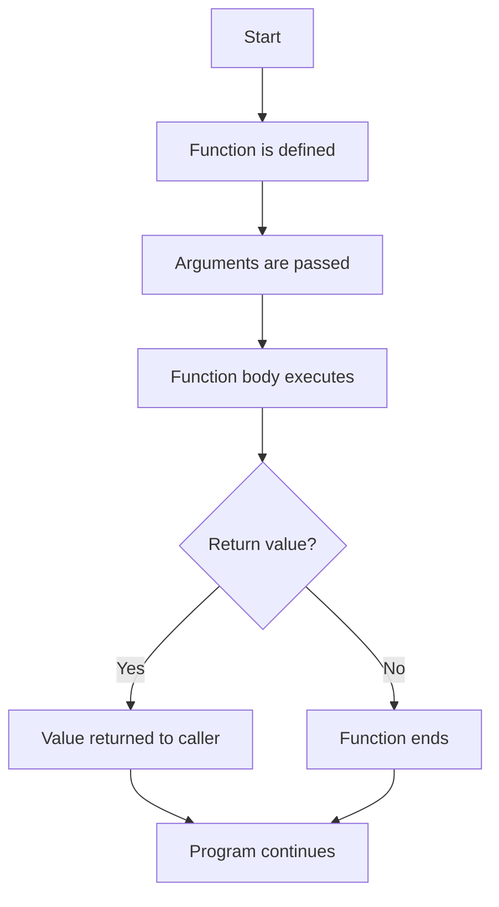

# Interview Q&A for JavaScript + Playwright Learning Notes

This file is based on the examples available in the project folders such as [chapter_02_Java_Concepts](../chapter_02_Java_Concepts), [chapter_03_Identifiers](../chapter_03_Identifiers), [chapter_04_Literals](../chapter_04_Literals), [chapter_05_Operators](../chapter_05_Operators), [chapter_06_Switch_Statement](../chapter_06_Switch_Statement), [chapter_07_If_Else_Statements](../chapter_07_If_Else_Statements), [chapter_08_Loops](../chapter_08_Loops), [chapter_09_Arrays](../chapter_09_Arrays), and [chapter_10_Functions](../chapter_10_Functions).

## 1. JavaScript Basics

### Q1. What is JavaScript?
**Answer:** JavaScript is a programming language used to make webpages interactive and to automate browser actions in tools like Playwright.

### Q2. What is the difference between `let`, `const`, and `var`?
**Answer:**
- `var` is old and has function scope.
- `let` can be reassigned but not redeclared in the same scope.
- `const` cannot be reassigned.

```js
let age = 20;
const name = "John";
```

### Q3. What is a variable?
**Answer:** A variable is a container used to store data.

```js
let score = 100;
```

---

## 2. Identifiers and Comments

### Q4. What is an identifier?
**Answer:** An identifier is the name given to variables, functions, or objects.

```js
let studentName = "Amit";
```

### Q5. What are the rules for identifiers?
**Answer:**
- They should start with a letter, `_`, or `$`.
- They cannot start with a number.
- They should be meaningful and readable.

### Q6. What are comments in JavaScript?
**Answer:** Comments are used to explain code. They are ignored by the JavaScript engine.

```js
// Single-line comment
/* Multi-line comment */
```

---

## 3. Literals and Data Types

### Q7. What is a literal?
**Answer:** A literal is a fixed value written directly in code.

```js
let name = "Alice"; // string literal
let age = 25;       // number literal
let isActive = true; // boolean literal
```

### Q8. What is the difference between `null` and `undefined`?
**Answer:**
- `undefined` means a variable is declared but has no value yet.
- `null` means the value is intentionally empty.

```js
let a;
console.log(a); // undefined

let b = null;
console.log(b); // null
```

### Q9. What are the main JavaScript data types?
**Answer:** String, Number, Boolean, Null, Undefined, Object, Symbol, and BigInt.

### Q10. What does `typeof` do?
**Answer:** It tells the data type of a value.

```js
console.log(typeof "Hello"); // string
console.log(typeof 10);       // number
```

---

## 4. Operators

### Q11. What is the difference between `==` and `===`?
**Answer:**
- `==` compares only values.
- `===` compares both value and type.

```js
console.log(5 == "5");  // true
console.log(5 === "5"); // false
```

### Q12. What is the ternary operator?
**Answer:** It is a short form of `if-else`.

```js
let age = 18;
let result = age >= 18 ? "Adult" : "Minor";
```

### Q13. What is the nullish coalescing operator (`??`)?
**Answer:** It returns the right-side value when the left-side is `null` or `undefined`.

```js
let value = null ?? "Default";
console.log(value); // Default
```

### Q14. What is the difference between `++` and `--`?
**Answer:** They increase or decrease a number by 1.

```js
let x = 5;
x++;
console.log(x); // 6
```

---

## 5. Conditional Statements

### Q15. What is the difference between `if`, `else if`, and `else`?
**Answer:** They are used to run code based on conditions.

```js
let age = 18;
if (age >= 18) {
  console.log("Adult");
} else {
  console.log("Minor");
}
```

### Q16. What is a `switch` statement?
**Answer:** It is useful when you want to compare one value against many cases.

```js
let day = 2;
switch (day) {
  case 1: console.log("Monday"); break;
  case 2: console.log("Tuesday"); break;
  default: console.log("Other");
}
```

---

## 6. Loops

### Q17. What is the difference between `for`, `while`, and `do...while`?
**Answer:**
- `for` is used when the number of iterations is known.
- `while` checks the condition before running.
- `do...while` runs at least once before checking the condition.

### Q18. What is the use of `break` and `continue`?
**Answer:**
- `break` stops the loop completely.
- `continue` skips the current iteration.

```js
for (let i = 0; i < 5; i++) {
  if (i === 2) continue;
  console.log(i);
}
```

---

## 7. Arrays

### Q19. What is an array?
**Answer:** An array stores multiple values in one variable.

```js
const fruits = ["Apple", "Banana", "Mango"];
```

### Q20. What is the difference between `push()` and `pop()`?
**Answer:**
- `push()` adds an element to the end.
- `pop()` removes the last element.

### Q21. What is the difference between `unshift()` and `shift()`?
**Answer:**
- `unshift()` adds an element to the start.
- `shift()` removes the first element.

### Q22. What is `splice()` used for?
**Answer:** `splice()` is used to add, remove, or replace elements. It changes the original array.

```js
let arr = [1, 2, 3];
arr.splice(1, 1, 99);
console.log(arr); // [1, 99, 3]
```

### Q23. What is the difference between `splice()` and `slice()`?
**Answer:**
- `splice()` changes the original array.
- `slice()` creates a new array and leaves the original unchanged.

### Q24. What is `indexOf()` and `includes()` used for?
**Answer:** They are used to search for an element in an array.

```js
let result = ["Pass", "Fail", "Skip"];
console.log(result.indexOf("Skip")); // 2
console.log(result.includes("Pass")); // true
```

### Q25. What is the difference between `find()` and `filter()`?
**Answer:**
- `find()` returns the first matching value.
- `filter()` returns all matching values.

### Q26. What is `map()`, `filter()`, and `reduce()` used for?
**Answer:**
- `map()` transforms each item.
- `filter()` keeps selected items.
- `reduce()` combines values into one result.

```js
let nums = [1, 2, 3];
let doubled = nums.map(x => x * 2);
let even = nums.filter(x => x % 2 === 0);
let total = nums.reduce((sum, x) => sum + x, 0);
```

### Q27. How can you check if a value is an array?
**Answer:** Use `Array.isArray(value)`.

```js
let nums = [1, 2, 3];
console.log(Array.isArray(nums)); // true
```

### Q28. What is array destructuring?
**Answer:** It allows you to unpack values from an array into variables.

```js
let [first, second] = ["A", "B"];
console.log(first); // A
```

---

## 8. Functions in JavaScript

### Q29. What is a function in JavaScript?
**Answer:** A function is a reusable block of code that performs a specific task.

```js
function greet() {
  console.log("Hello");
}

greet();
```

### Q30. What is the difference between a parameter and an argument?
**Answer:**
- A parameter is a variable declared in the function definition.
- An argument is the actual value passed when the function is called.

```js
function add(a, b) { // a and b are parameters
  return a + b;
}

console.log(add(2, 3)); // 2 and 3 are arguments
```

### Q31. What is the use of `return` in a function?
**Answer:** `return` sends a value back to the caller.

```js
function square(num) {
  return num * num;
}

console.log(square(4)); // 16
```

### Q32. What is a function declaration?
**Answer:** A function declaration defines a function using the `function` keyword.

```js
function greetUser() {
  console.log("Welcome!");
}
```

### Q33. What is a function expression?
**Answer:** A function expression assigns a function to a variable.

```js
const greet = function(name) {
  return `Hello, ${name}`;
};
```

### Q34. What is an arrow function?
**Answer:** An arrow function is a shorter syntax for writing functions.

```js
const multiply = (a, b) => a * b;
console.log(multiply(2, 4)); // 8
```

### Q35. What are default parameters?
**Answer:** Default parameters provide fallback values if an argument is not provided.

```js
function welcome(name = "Guest") {
  return `Hello, ${name}`;
}

console.log(welcome()); // Hello, Guest
```

### Q36. What is a callback function?
**Answer:** A callback function is passed as an argument to another function and executed later.

```js
function greetLater(name, callback) {
  callback(name);
}

greetLater("Amit", function(n) {
  console.log(`Hello, ${n}`);
});
```

### Q37. What is an IIFE?
**Answer:** An IIFE is an Immediately Invoked Function Expression that runs as soon as it is defined.

```js
(function () {
  console.log("Runs immediately");
})();
```

### Q38. What is hoisting in functions?
**Answer:** Hoisting allows function declarations to be called before they are defined in code.

```js
showMessage();

function showMessage() {
  console.log("Hi");
}
```

### Q39. What is the difference between a normal function and an arrow function?
**Answer:**
- Normal functions have their own `this` behavior.
- Arrow functions inherit `this` from the surrounding scope.

```js
const obj = {
  value: 10,
  show: function() {
    console.log(this.value);
  },
  showArrow: () => {
    console.log(this.value);
  }
};
```

### Q40. Why are functions important in Playwright?
**Answer:** Functions help make test scripts reusable and cleaner. Common actions like login, navigation, and assertion logic can be placed inside functions.

```js
function login(username, password) {
  console.log(`Logging in as ${username}`);
  return true;
}

login("admin", "1234");
```

### Function Flow Diagram



### Quick Revision Tips
- Learn the syntax of function declaration, expression, and arrow function.
- Understand the difference between `parameter` and `argument`.
- Remember that `return` sends back a value.
- Practice callback functions and IIFE concepts.
- Know why functions are useful in automation and Playwright.

---

## 9. Why These Topics Matter in Playwright

### Q29. Why are loops important in automation?
**Answer:** Loops help repeat the same action many times, such as checking multiple rows or opening several pages.

### Q30. Why are arrays useful in test automation?
**Answer:** Arrays are useful for storing test data, URLs, selectors, expected results, and page elements.

---

## 10. Final Interview Tips

- Practice writing small code examples from memory.
- Be clear about the difference between value comparison and type comparison.
- Know the common array methods: `push`, `pop`, `shift`, `unshift`, `splice`, `slice`.
- For automation interviews, explain your logic simply and confidently.
